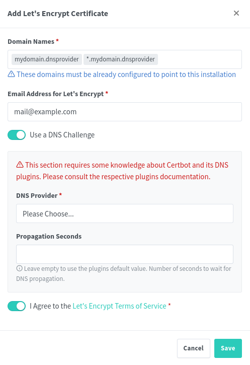
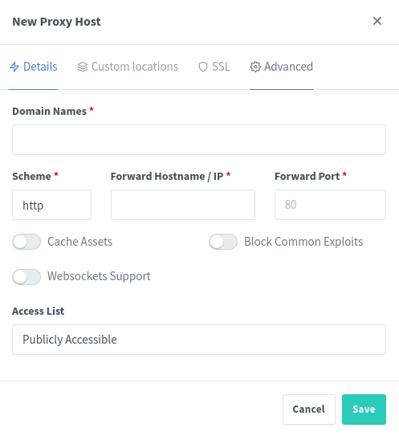
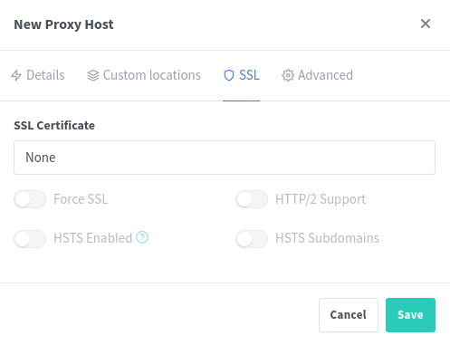

# Nginx Proxy Manager Configuration
Configuration to have working SSL Certificates with Let's Encrypt using a DDNS. This procedure was heavily inspired by [Wolfgang's](https://www.youtube.com/watch?v=qlcVx-k-02E) tutorial on YouTube.

## Login and first use
For the first usage, login with the default credentials:

```
Username: admin@example.com
Password: changeme
```

And follow the on-screen instructions to create your User Account with Administrator Privileges.

## DDNS
It is possible to use one of the supported for the DNS Challenge in NPM: including Cloudflare, FreeDNS, IONOS or NameCheap.

You just have to setup a domain and insert a DNS Record for the local IP of the Nginx Proxy Manager Server.

## NPM Configuration
### SSL Certificate Creation
In the "SSL Certificate" Tab add an SSL Certificate and add the Domain name in the dialog box. It is possible to certificate multiple subdomains using this same SSL Certificate if it is setup as follows:



If the procedure fails, try increasing the "Propagation Seconds" field up to 120, 240 or 300s.

### Certify Hosts
To apply the SSL Certificate to each Container move to the Hosts, and then Proxy Hosts tab to finally add a Proxy Host.

Insert a Domain name, the address (or the container name since Docker has a DNS Server) and the port of the application in the "Details" tab.



It is advisable to activate "Block Common Exploits" and, if needed by the service, activate the Websockets Support.

Then in the "SSL" tab apply the certificate and activate the "Force SSL" and "HTTP/2" switches. You can optionally enable HSTS and its subdomains.



At this point you should be able to rech your hosts with the Domains you chose and using an Encrypted SSL Connection using a valid and trusted certificate by Let's Encrypt.