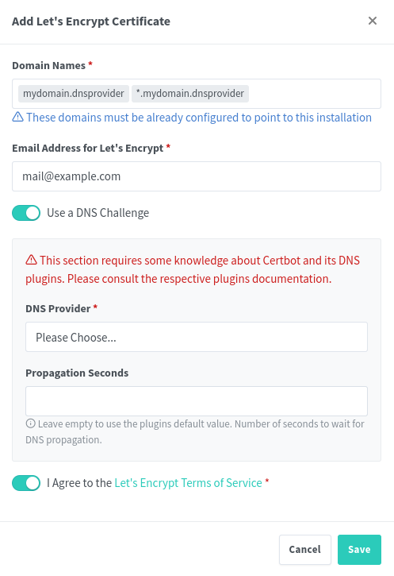

# Ngnix Proxy Manager Configuration

Configuration to have working SSL Certificates with Let's Encrypt using a DDNS. This procedure was heavily inspired by [Wolfgang's](https://www.youtube.com/watch?v=qlcVx-k-02E) tutorial on YouTube.

## DDNS

It is possible to use one of the supported for the DNS Challenge in NPM, including Cloudflare, FreeDNS, IONOS or NameCheap.
You just have to setup a domain and insert a DNS Record for the local IP of the Ngnix Proxy Manager Server.

## NPM Configuration

### SSL Certificate Creation

In the "SSL Certificate" Tab add an SSL Certificate and add the Domain name in the dialog box. It is possible to certificate multiple subdomains using this same SSL Certificate if it is setup as follows:

If the procedure fails, try increasing the Propagation Seconds field up to 120, 240 or 300s.

### Certify Hosts

To apply the SSL Certificate to each Host move to the Hosts > Proxy Hosts tab and add a Proxy Host.

Insert a Domain name, the address and the port of the application in the "Details" tab.

Then in the "SSL" tab apply the certificate and activate the "Force SSL" and "HTTP/2" switches.

At this point you should be able to rech your hosts with the Domains you chose and using an Encrypted SSL Connection using a valid and trusted certificate by Let's Encrypt.