# Installation of Fedora Server

This setup is for the HP-290G1, which has two storage drives:
* A 512GB NVMe SSD;
* A 1TB 7200RPM Mechanical HDD.


## Disk Partitions

The Partition Table will look as follows:

| Device           | Type         | Format | Mountpoint  |
|------------------|--------------|--------|-------------|
| `/dev/nvme0n1p1` | Partition    | EFI    | `/boot/efi` |
| `/dev/nvme0n1p2` | BTRFS Volume | BTRFS  | Unassigned  |
| `/dev/sda1`      | Partition    | ext4   | Unassigned  |

In which the Boot Drive will be represented by the `/dev/nvme0n1` device, and the Mass Storage HardDrive will be the `/dev/sda` device.

The BTRFS Volume will also host a `@` and a `@home` subvolume to mount the Root partition and the Home partition on separate subvolumes. The result of this operation should look like what follows:

| Device  | Type            | Format | Mountpoint |
|---------|-----------------|--------|------------|
| `@`     | BTRFS Subvolume | BTRFS  | `/`        |
| `@home` | BTRFS Subvolume | BTRFS  | `/home`    |

Setup in a VM with two Virtual Disks so to generalize more, you should get a partition schema similar to what is shown below:

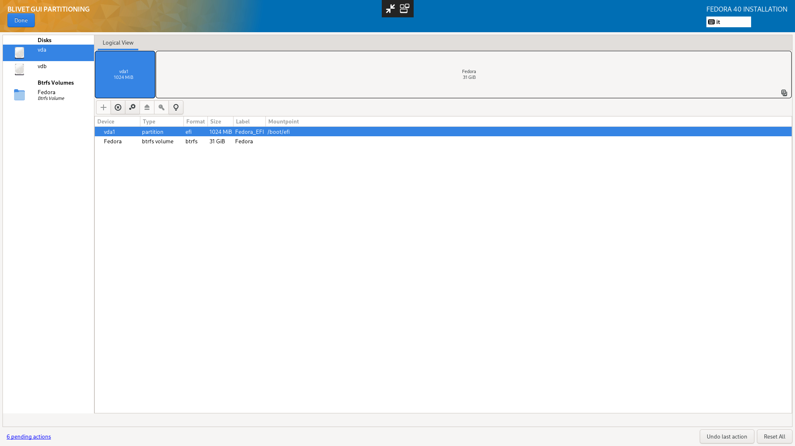
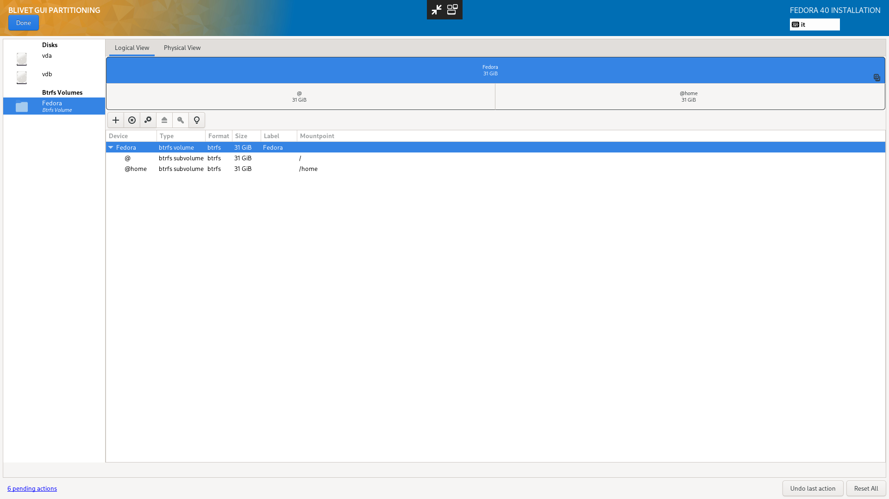
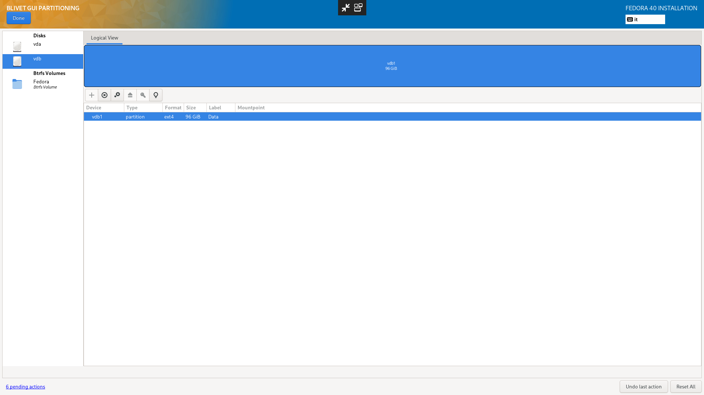


## Network

I have chosen to assign a static local IP address to the machine for convenience. You could also give it an Hostname already, but I personally missed the text field while installing.


## Additional Software

From the list have been checked:
* Container Management;
* Headless Management.

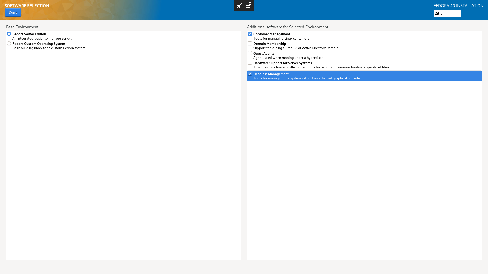


## Accounts

I have chosen not to activate the Root account and just use an unprivileged one which could use sudo to escalate its privileges.


## Post Intall

### Updating the System

By launching the command `sudo dnf upgrade --refresh -y` the System will start the update process. This will take a while.

### Changing the Hostname

Just write it down in the `/etc/hostname` file. Use the Text Editor you want, I like `micro` for its semplicity and easy of use, but you could also install `nano`, or use `vi` or `vim` which are already included.

```shell
$ sudo dnf install -y micro
$ sudo micro /etc/hostname
```

And then save and exit.

You could also set it in the Network Settings while installing, but I personally didn't notice the field when I was going through it. Either way, the result is basically the same.

### Editing the Grub Configuration File

Opening the Grub Configuration file (`/etc/default/grub`) I edit the following parameters:
* `GRUB_TIMEOUT` and set it to `0`;
* `GRUB_CMDLINE_LINUX` and add `intel_iommu=on iommu_pt=on`.

Obviously the last setting is specific for my machine, if you have an AMD CPU just use the `amd_iommu=on` flag.

After that, update the Grub configuration file by launching:

```shell
$ sudo grub2-mkconfig -o /boot/grub2/grub.cfg
```

### Reboot and start using the Web Shell (Cockpit)

The Web Shell will be available at the url `https://your.ip.v4.here:9090` after the machine finishes the boot up process.

The SSL Certificate will not be valid since it's just self-signed, but will do for the moment.

### Switch to Administrative access into the Web Shell

You can switch to administrative access by clicking on the banner in the top of the screen and typing your password.

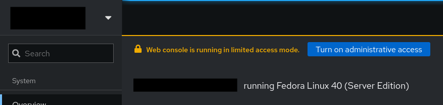

### Mount the Internal HDD into a specified folder

Open the Terminal Tab and create the folder where you want to mount the drive. For me it will be mounted in my Home folder inside the HDD subfolder.

```shell
$ mkdir $HOME/HDD 
```

Now move into the Storage Tab and click on the Drive you want to mount. Set the mountpoint of the Hard Drive to the folder you just created, confirm and mount. 

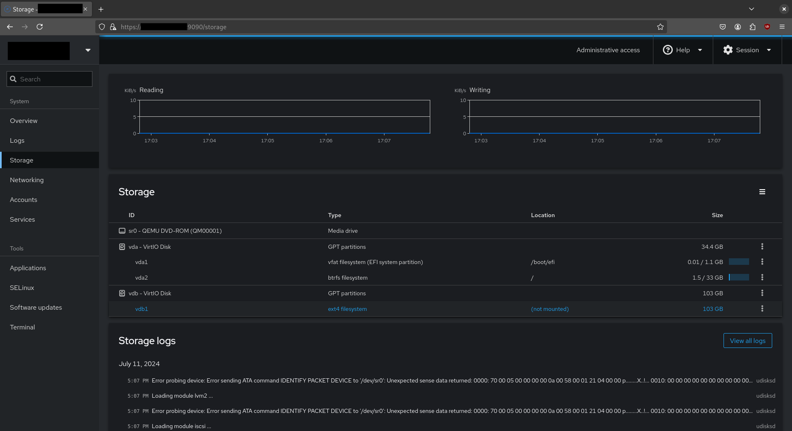
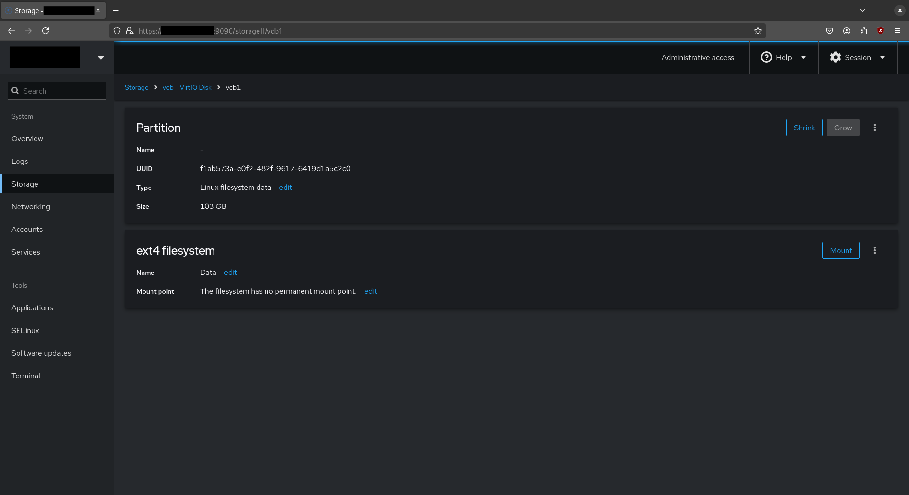
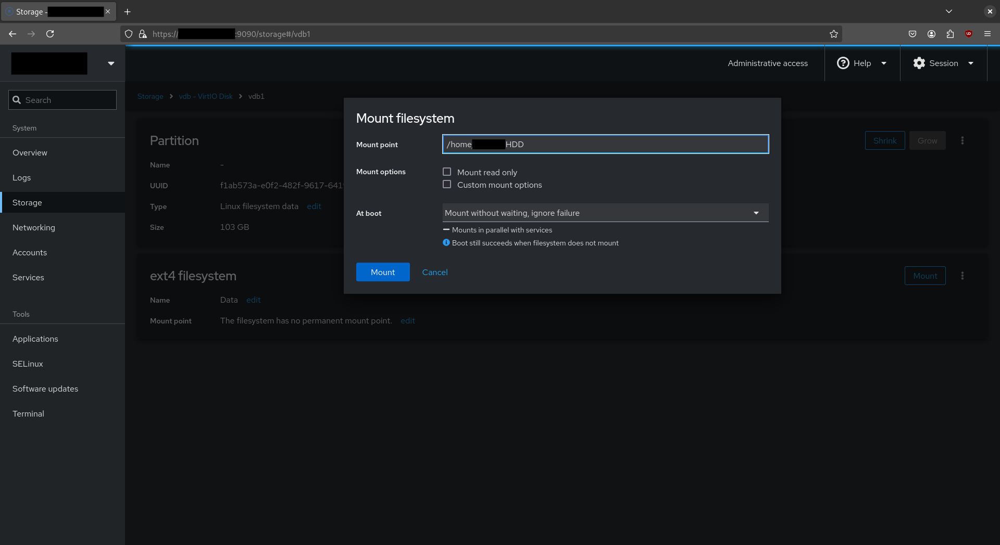

### Enable Automatic Updates

Go to the Software Updates Tab and enable Automatic Updates. The system will install `dnf-automatic` and ask for what kind of updates you want to install automatically and when. Note that the host will reboot once it finished updating to finalize the update process.

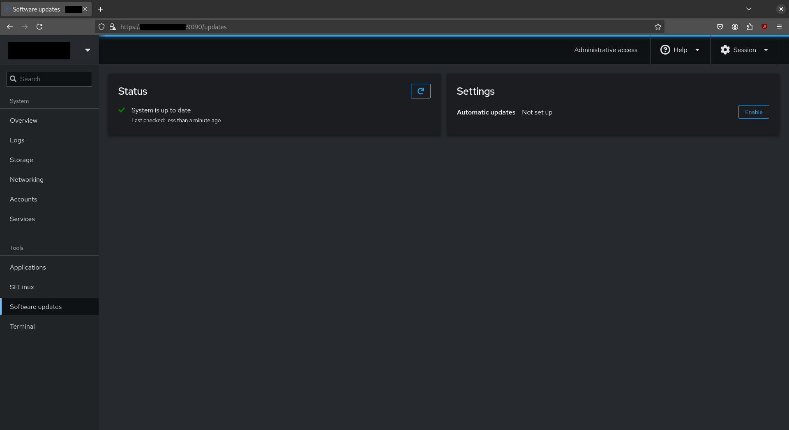
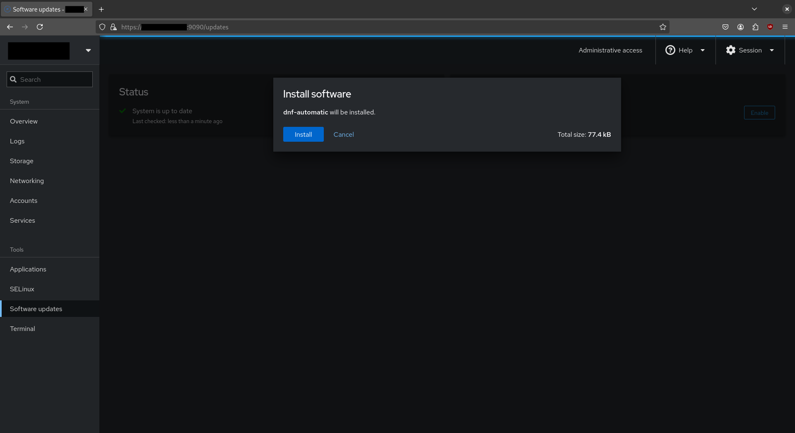
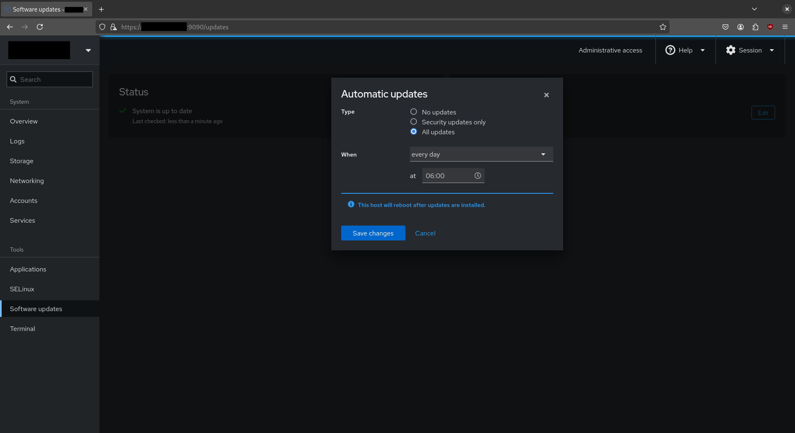

### Install Monitoring Utilities

From the Overview, click on View Metrics and History and then `Install cockpit-pcp` and confirm.

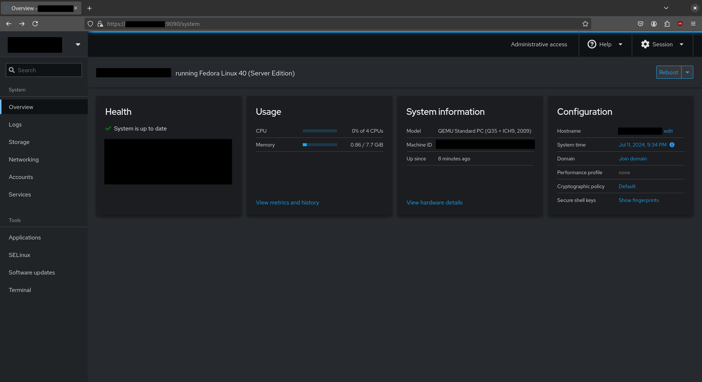
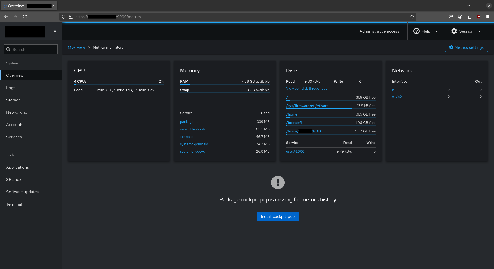

After that you will have to re-login into the Cockpit WebUI and activate the `pmlogger` and `pmproxy` services. The procedure will also install the `valkey` package.

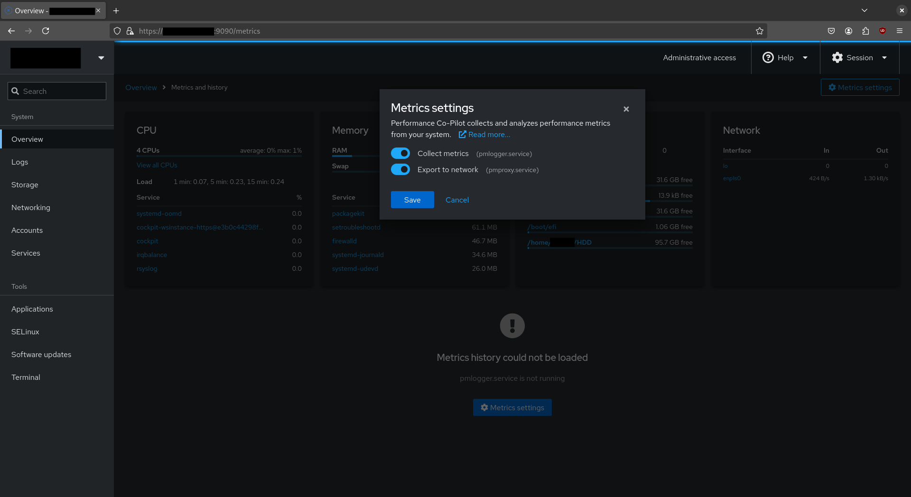

Once you have finished the usage statistics will be available.

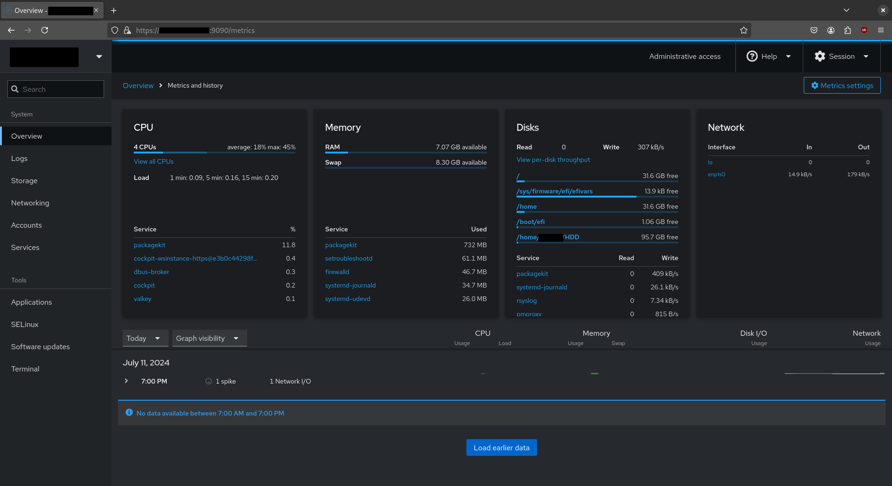