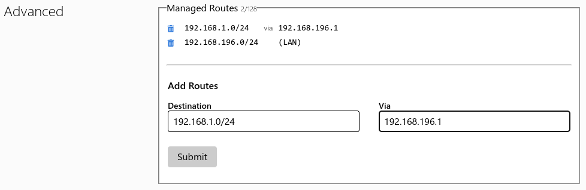

# ZeroTier
Since my home network is behind a [Carrier-Grade NAT](https://en.wikipedia.org/wiki/Carrier-grade_NAT), it is simpler (and cheaper) for me to use a Software Defined WAN like [ZeroTier](https://www.zerotier.com/product/) to access it from outside.

An Incus container will be used to install the ZeroTier client. It will then be used to forward packets as needed.

A similar method to the one explained in the OS Setup to install Docker will be used.

## ZeroTier Network
Just create a new Network [here](https://my.zerotier.com/network) with default settings.

## Crete the Container
Create the container:
```bash 
incus launch images:debian/trixie ZeroTier -c boot.autostart=true --profile default --profile bridge_lan
```
Enter the container using the `root` account:
```bash
incus shell ZeroTier
```
Now you are in the container's shell, and can start setting up what comes next.

## Set up a `root` password
Using the `passwd` command:
```shell
root@ZeroTier:~# passwd
New password: 
Retype new password: 
passwd: password updated successfully
```
Give the root account a **different** and **strong** password.

## Create an unprivileged user
Create the user, again giving it a **different** and **strong** password:
```bash
adduser user
```
Grant the user `sudo` privileges:
```bash
usermod -aG sudo user
```

## Set up a static address
Edit the `/etc/systemd/network/eth0.network` file (with `eth0` being the name of the interface we need).

Change the lines:
```ini
[Match]
Name=eth0

[Network]
DHCP=true

[DHCPv4]
UseDomains=true
UseMTU=true

[DHCP]
ClientIdentifier=mac
```
To:
```ini
[Match]
Name=eth0

[Network]
Address=your.desired.address.here/netmask
Gateway=your.default.gateway.address
DNS=your.default.dns.address
```

### Setup ZeroTier and Enable Forwarding with IPTables
Use the `Setup.sh` script available in this repository. Its creation has been inspired by the [ZeroTier documentation](https://docs.zerotier.com/route-between-phys-and-virt/).

## Manage Routes to Home Network in the ZeroTier Dashboard
In the `Advanced` tab look for the `Managed Routes` menu. Add to the `Destination` your Network subnet in CIDR Notation (for example `192.168.1.0/24`), and in the `Via` field write down the IP of your server. It should look something like this:



After that you can click on the "Submit" button to apply your rule.