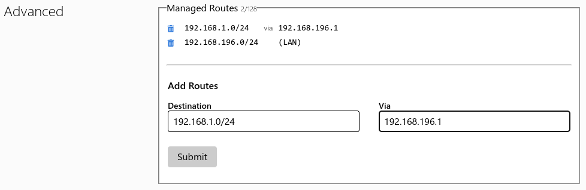

# ZeroTier

Since my home network is behind a [Carrier-Grade NAT](https://en.wikipedia.org/wiki/Carrier-grade_NAT), it is simpler (and cheaper) for me to use a Software Defined WAN like [ZeroTier](https://www.zerotier.com/product/) to access it from outside.

Since I want to keep the services on my Proxmox instance just inside my Home Network, I needed a Server which would route traffic from the ZeroTier Virtual LAN to my physical LAN.

The Server functionality will be unwound by an LXC Container.


## ZeroTier Network
Just a new Network created [here](https://my.zerotier.com/network) with default settings.


## The Container

As anticipated it is an LXC Container with the following hardware allocated:
* 1 CPU Core;
* 512MB RAM + 512MB of Swap Space;
* 4GB of Disk Space.

The container runs on Debian 12 "Bookworm" (template downloaded from the Proxmox default list).


## First boot and setup

### Updates

First off, the OS got updated:

```console
root@ZeroTier# apt update && apt full-upgrade -y
```

Then I proceded restarting the container to fully apply the updates.

### Non-Root User

At this point I wanted to add a non-root user to the system, so I installed `sudo`:

```console
root@ZeroTier# apt install -y sudo
```

And then I created a new user, which I added to the `sudo` group:

```console
root@ZeroTier# adduser zt
root@ZeroTier# usermod -aG sudo zt
```

At this point I could login as non-root, and test if the configuration worked:

```console
zt@ZeroTier:~$ sudo apt update
[sudo] password for zt: 
Hit:1 http://security.debian.org bookworm-security InRelease
Hit:2 http://deb.debian.org/debian bookworm InRelease
Hit:3 http://deb.debian.org/debian bookworm-updates InRelease
Reading package lists... Done
Building dependency tree... Done
Reading state information... Done
All packages are up to date.https://forum.proxmox.com/members/bill-mcgonigle.61031/
```

### Allow for Network Interfaces to be created on the Container

To make sure that a Virtual Network Interface can be created in the LXC Container, it is possible to add the following line to the file `/etc/pve/lxc/ContainerID.conf`:

```config
lxc.mount.entry = /dev/net dev/net none bind,create=dir
```

Which will mount the `/dev/net` folder in the Container. Credits for this workaround go to [Bill McGonigle](https://forum.proxmox.com/members/bill-mcgonigle.61031/) in [this](https://forum.proxmox.com/threads/openvpn-in-unprivileged-container.38670/) Thread.


## Installing the ZeroTier Client on the Server
Following the Instructions found [here](https://www.zerotier.com/download/), installing the client on the Debian Container was as easy as running the following script:
```bash
curl -s 'https://raw.githubusercontent.com/zerotier/ZeroTierOne/main/doc/contact%40zerotier.com.gpg' | gpg --import && if z=$(curl -s 'https://install.zerotier.com/' | gpg); then echo "$z" | sudo bash; fi
```

There is a chance that you may not have installed the `curl` and `gpg` packages, therefore the script will throw an error. Here is the command to fix that:
```bash
sudo apt install -y curl gpg
```


## Configuring the Server to route External Traffic into my home Network

The steps followed are documented on the dedicated page of the [ZeroTier Documentation](https://docs.zerotier.com/route-between-phys-and-virt/).

### Joining the ZeroTier Network

Joining a network is just a matter of running the command below:

```bash
sudo zerotier-cli join NETWORK_ID
```

To which the expected output if everything goes well is `200 join OK`. Note that you have to replace the `NETWORK_ID` variable with the effective ID of your ZeroTier Network.

Before going any further you should authorize your Server on the Network using the Web Dashboard at the link `https://my.zerotier.com/network/NETWORK_ID`.

To check that everything is working just run the following:

```bash
sudo zerotier-cli listnetworks
```

If everything is ok, the output should be similar to what is listed below:

```console
zt@ZeroTier:~$ sudo zerotier-cli listnetworks
[sudo] password for zt: 
200 listnetworks <nwid> <name> <mac> <status> <type> <dev> <ZT assigned ips>
200 listnetworks NetworkID HomeLab MA:C_:AD:DR:ES:S_ OK PRIVATE ztdummyname 192.168.196.1/24
```

### Manage Routes to Home Network in the ZeroTier Dashboard

In the `Advanced` tab look for the `Managed Routes` menu. Add to the `Destination` your Network subnet in CIDR Notation (for example `192.168.1.0/24`), and in the `Via` field write down the IP of your server. It should look something like this:



After that you can click on the "Submit" button to apply your rule.

### Enable IPv4 Forwarding in the Server

Just edit the file `/etc/sysctl.conf` and uncomment the line
```
net.ipv4.ip_forward=1
```

### Configure `iptables`

Last thing to do is to add a set of rules to `iptables` and make them persistent.

Before starting, install the packages `iptables` via your package manager and take note of the interfaces used by the container to connect to the Home Network and to connect to the ZeroTier LAN by using the command `ip addr`:

```console
zt@ZeroTier:~$ ip addr
1: lo: <LOOPBACK,UP,LOWER_UP> mtu 65536 qdisc noqueue state UNKNOWN group default qlen 1000
    link/loopback 00:00:00:00:00:00 brd 00:00:00:00:00:00
    inet 127.0.0.1/8 scope host lo
       valid_lft forever preferred_lft forever
    inet6 ::1/128 scope host noprefixroute 
       valid_lft forever preferred_lft forever
2: eth0@if12: <BROADCAST,MULTICAST,UP,LOWER_UP> mtu 1500 qdisc noqueue state UP group default qlen 1000
    link/ether bc:24:11:34:3e:6b brd ff:ff:ff:ff:ff:ff link-netnsid 0
    inet 192.168.1.5/24 brd 192.168.1.255 scope global eth0
       valid_lft forever preferred_lft forever
    inet6 fe80::be24:11ff:fe34:3e6b/64 scope link 
       valid_lft forever preferred_lft forever
3: ztdummyname: <BROADCAST,MULTICAST,UP,LOWER_UP> mtu 2800 qdisc pfifo_fast state UNKNOWN group default qlen 1000
    link/ether 92:24:bf:82:f8:62 brd ff:ff:ff:ff:ff:ff
    inet 192.168.196.1/24 brd 192.168.196.255 scope global ztdummyname
       valid_lft forever preferred_lft forever
    inet6 fe80::9024:bfff:fe82:f862/64 scope link 
       valid_lft forever preferred_lft forever
```

In this case, the one that interfaces with the Home Network is `eth0`, and the ZeroTier one is the `ztdummyname` (note that the ZeroTier interfaces always start with a `zt` prefix).

Then, add the rules to `iptables`:

```bash
sudo iptables -t nat -A POSTROUTING -o eth0 -j MASQUERADE
```

This adds a NATting rule to rewrite the source address of any packet outgoing `eth0` to be rewritten with the IP of the Interface `eth0`.

```bash
sudo iptables -A FORWARD -i ztdummyname -o eth0 -j ACCEPT
sudo iptables -A FORWARD -i eth0 -o ztdummyname -m state --state RELATED,ESTABLISHED -j ACCEPT
``` 

These two add a rule to forward traffic coming from the ZeroTier LAN to the Home Network and vice versa.

Now what it's left to do is to make those rules persistent. Start by installing the package `iptables-persistent` and then run:

```bash
sudo iptables-save
```

### Reboot

At this point you just have to reboot the container and the ZeroTier LAN and your home LAN should be communicating.